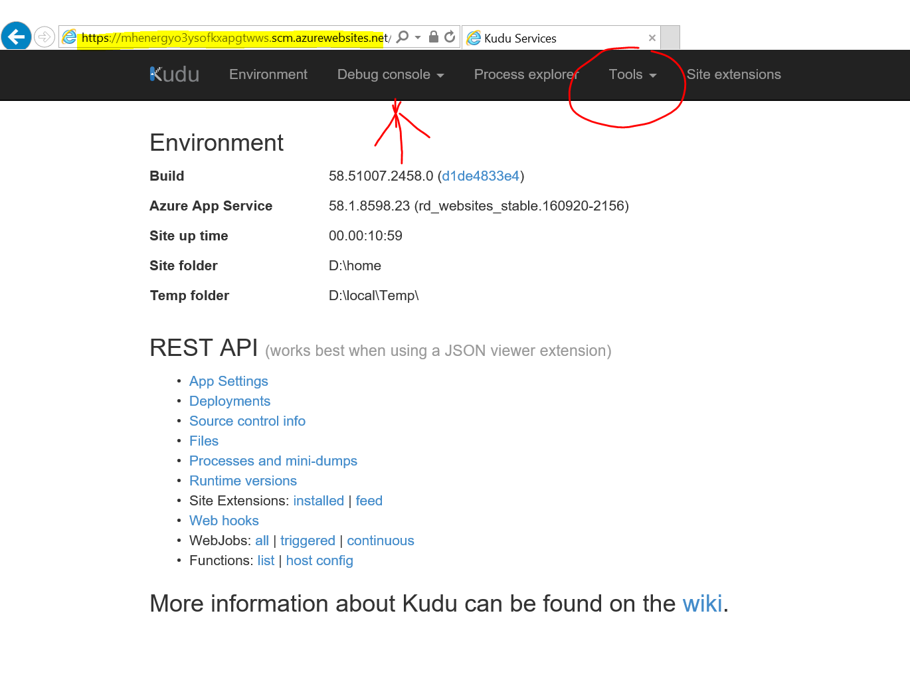
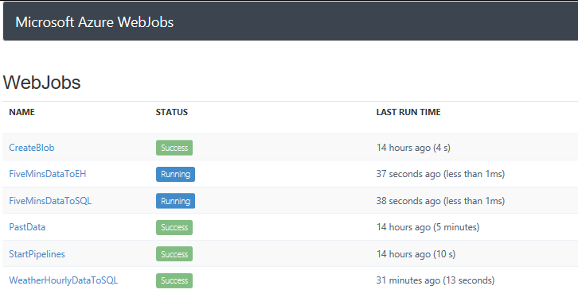
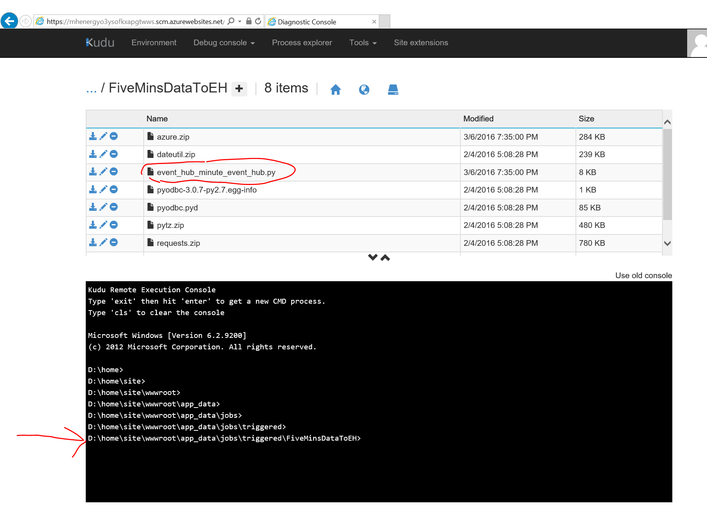
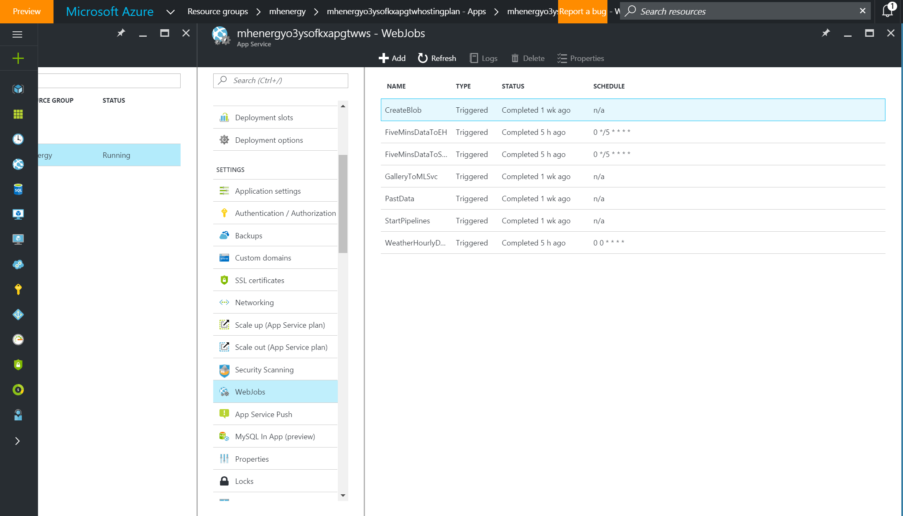

## Lab on Web Jobs - Monitor Data In Motion and at Rest


## Monitor Web Job

1.  Go to https://\<name of your App Service\>.scm.azurewebsites.net/ to see an UI for interacting with your web jobs. <br>

2.  Select the "Web Jobs dashboard" under "Tools"<br>
3.  You will see a list similar to this:<br>
<br>
**QUESTION:**  Which is slow-moving data or data-at-rest and which is fast-moving data?  Which ones are triggered and which are continuous web jobs?<br>
4.  Now let's drill into the Debug Console (red arrow in first screenshot) to find the web job code base.  Go to "Debug Console" and "CMD", then drill down as in the following screenshot (see red arrow) (under: `site -> wwwroot -> app_data -> jobs`):<br>
<br>
**QUESTION:**  For triggered jobs what do you think a CRON expression means and does?<br>
NOTE on GitHub:  Often, the `wwwroot` folder is copied up to a GitHub repository for version control and public access for sharing.<br>
5.  Take a look at the python script and the `settings.job` files of the FiveMinsDataToEH job by clicking the pencil or edit button.  You can also download these from here in the console.  What do you think this job is doing and how often?
5.  The Web Jobs are also accessible in the Azure portal.  Go to the App Service resource, then under Settings select WebJobs.  This will give you a view of the running jobs or if they are stopped you may refresh here.  You may also add new jobs in the Azure portal and on this page.<br>


```
Answers below.


```

## Answers

1.  Which is slow-moving data or data-at-rest and which is fast-moving data?

**Data-at-rest**:  One-time running web jobs are used to start certain Azure services.
* PastData: Copies the historical consumption and weather sample data to Azure SQL
* GalleryToMLSvc: Creates demand forecast ML experiment and publish it as ML WebService
* StartPipelines: Starts the StreamAnalysis pipeline

**Data-in-motion or fast-moving data**:  Continuous running web jobs are used as data generator.
* FiveMinsDataToEH: Simulates energy consumption data and sends it to Event Hub every 5 minutes.
* FiveMinsDataToSQL: Simulates energy consumption data and sends it to Azure SQL every 5 minutes.
* WeatherHourlyDataToSQL: Simulates weather data and sends it to Azure SQL every hour.

They are all triggered Web Jobs.

2.  For example, this CRON expression "0 */5 * * * *" means, run every 5 minutes.  This is in the file settings.job alongside the script.  Web Jobs can be created from the Azure portal itself.
