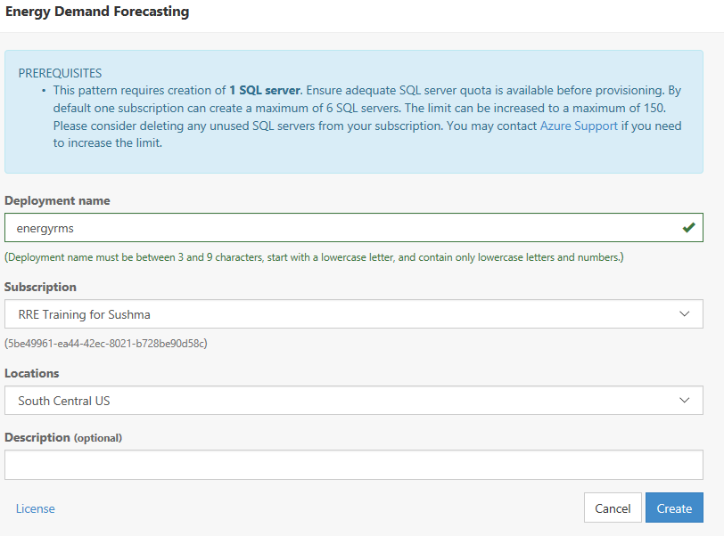

##  Deploying the Energy Demand Forecasting Template

After, you have ensured your Azure account has the Azure credits given in the Passes for the instructor-led format or enough for 4 days of use (Standard tiers for:  App Services, Streaming Analytics, Event Hubs, SQL DB, Data Factory, SQL Server) AND that you have been "whitelisted" (instructions found [here](PREREQUISITES.md)) plesae do the following:

1.  Make sure you can access https://start.cortanaintelligence.com.  When there, ensure that you can:
  * Navigate to "DEPLOYMENTS"
  * Click on "+New" button in upper right corner
  * See the small "More" link at the bottom left
  * After clicking on "More", ensure you can see the "Energy Demand Forecasting" solution template card (about 1/2 of the way down the page) 

2.  Give your solution a good name (e.g. `octenergymh`) - this will be the prefix of your resources and the name of your resource group.  **IMPORTANT**:  If you have not acknowledged this one-time agreement and disclaimer for solution templates in general please do so now at: http://go.microsoft.com/fwlink/?LinkId=534873. 

3.  Give your SQL database admin user a name and password (write these down now to remember them).  Now you may click "Deploy" to deploy the entire solution template. 

4.  An architecture diagram will pop up with the status of the resources.  This provisioning step may take up to 20 minutes. 

5.  Congratulations, you now have a solution template deployed!  We will be using this for the duration of the training.  A set of instructions will come up after everything is provisioned with more information and links for the resources.  Feel free to read through these.
