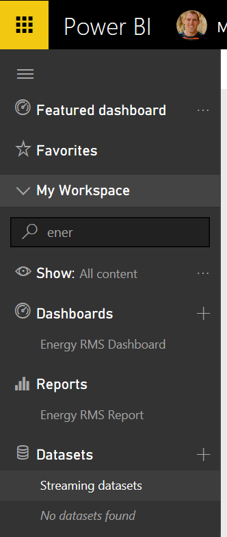
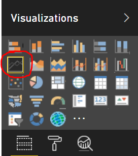
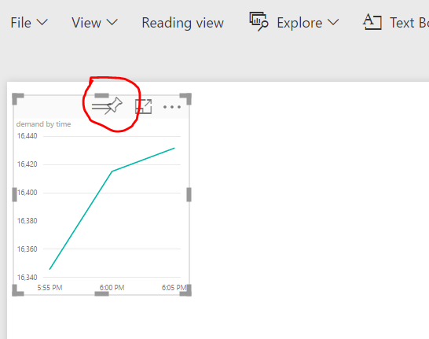

## ASA PBI setup
* ASA job:  `<YourSolutionName>sajob`
* output alias:  `PBIoutput`
* dataset name:  `EnergyDemandData`
* PBI report name:  `EnergyStreamDataReport` (also use for dashboard name)
* make sure Web jobs are running and inputblob has a path pattern specified (in classic portal)

## Setup Hot Path Dashboard

The following steps will guide you how to visualize real time data output from Stream Analytics jobs that were generated at the time of solution deployment. A Power BI online account is required to perform the following steps. If you don't have an account, you can create one.

### Add Power BI output in Azure Stream Analytics (ASA).

You will need to follow the instructions in Azure Stream Analytics & Power BI: A real-time analytics dashboard for real-time visibility of streaming data to set up the output of your Azure Stream Analytics job as your Power BI dashboard.

1.  Locate the stream analytics job in your Azure management portal. The name of the job should be: **`<YourSolutionName>sajob`** (e.g. `mhenergysajob`)
2.  Add a PowerBI output for the ASA job. Set the Output Alias as **`PBIoutput`**. Set your Dataset Name and Table Name as **`EnergyStreamData`**. Once you have added the output, click **Start** at the bottom of the page to start the Stream Analytics job. You should get a confirmation message.

### Create a dashboard in Power BI online:

On the left panel Datasets section in My Workspace, you should be able to see a new dataset showing on the left panel of Power BI. This is the streaming data you pushed from Azure Stream Analytics in the previous step.  Make sure the Visualizations pane is open and is shown on the right side of the screen.

Create the "Demand by Timestamp" tile:

1.  Click dataset **`EnergyStreamData`** on the left panel Datasets section.

*  Click "Line Chart" icon

*  Click **`EnergyStreamData`** in Fields panel.
*  Click “time” and make sure it shows under "Axis". Click “demand” and make sure it shows under "Values".  Otherwise, drag and drop these fields into the apprpriate locations in the Visualizations panel.
*  Click **Save** on the top-right and name the report as **`EnergyStreamDataReport`**. The report named **`EnergyStreamDataReport`** will be shown in Reports section in the Navigator pane on left.
*  Click “Pin Visual” icon on top right corner of this line chart, a "Pin to Dashboard" window may show up for you to choose a dashboard. Please select or fill in with **`EnergyStreamDataReport`** (note, I use the same name as report, but you can choose any name), then click "Pin".

*  Hover the mouse over this tile on the dashboard, click "edit" icon on top right corner to change its title as "Demand by Timestamp" with no subtitle or something descriptive.
*  Create other dashboard tiles:
  - A Map
  - A single card with just the energy demand
  - A bar chart
  - others that you wish to try
  ...Then pin some or all to your dashboard
  


```


```

`outputpbi` -> `PBIoutput` like [this](/Code/ASA_query.sql)
